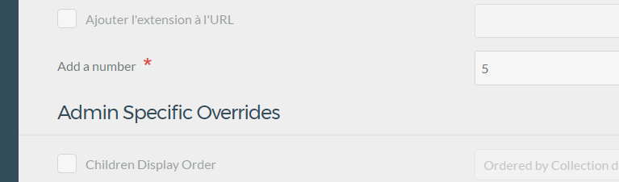

#Creer un nouveau modele de page

HHH
###Cahier des charges

On doit trouver les elements suivants

- Résumé
- Image du résumé
- Article
- Image
HHH
- Création d'un repertoire Francisco 
- Création d'une page francisco_1.md => on va donc appeller un modele francisco_1.html.twig

VVV
Dans cette page je n'oublier pas d'ajouter le

```html
---
title: mon titre
---
```
VVV
Ajouter la page francisco_1.html.twig dans votre repertoire template
```html




    {{ content }}



```
HHH
Ajouter une definition de nouveau type pour le type de page franscisco

Pour le rendre dépendante du theme, on va ajouter un repertoire blueprints dans note theme, et dans cette page ajouter une page
franscisco_1.yaml
VVV
Ajouter un element de menu au blue print

```html
title: Francisco_1
'@extends':
    type: default
    context: blueprints://pages


form:
  fields:
    tabs:
      type: tabs
      active: 1

      fields:
        advanced:
          fields:
            overrides:
              fields:
                header.an_example_text_field:
                  type: text
                  label: Add a number
                  default: 5
                  validate:
                    required: true
                    type: int
```

Ajoute une ligne dans l'ongket Avancé une option de formulaire demandant une entrée texte obligatoire qui devra être un entier



Pour info voici ce que l'on avait avant


HHH
HHH
The End :)
