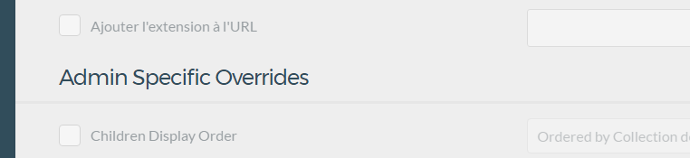

#Creer un nouveau modele de page

HHH
###Cahier des charges

On doit trouver les elements suivants

- Résumé
- Image du résumé
- Article
- Image
HHH
Se déplacer dans le repetoire user\pages
- Création d'un repertoire XX.Francisco (ic XX est le numéro d'ordre d'apparition dans le menu de l'élement que l'on va crée)
- Création d'une page francisco_1.md 
avoir nommé le fichier francisco_1.md  va provoquer l'appel à un modele d'affichage francisco_1.html.twig que l'on devra donc créer

VVV
Dans cette page francisco_1.md  je n'oublier pas d'ajouter le titre dans le Frontmatter
Faute de quoi la page n'apparait pas

```html
---
title: mon titre
---
```

VVV
Ajouter la page francisco_1.html.twig dans votre repertoire template
```html




    {{ content }}



```
HHH
Ajouter une definition de nouveau type pour le type de page franscisco

Pour le rendre dépendante du theme, on va ajouter un repertoire blueprints dans note theme, et dans cette page ajouter une page
franscisco_1.yaml
VVV
Ajouter un element de menu au blue print

```html
title: Francisco_1
'@extends':
    type: default
    context: blueprints://pages


form:
  fields:
    tabs:
      type: tabs
      active: 1

      fields:
        advanced:
          fields:
            overrides:
              fields:
                header.an_example_text_field:
                  type: text
                  label: Add a number
                  default: 5
                  validate:
                    required: true
                    type: int
```

VVV

Ajoute une ligne dans l'ongket Avancé une option de formulaire demandant une entrée texte obligatoire qui devra être un entier


Pour info voici ce que l'on avait avant



HHH
Vous voulez ajouter un image rien de plus simple : 

```ruby
custom_file:
  type: file
  label: A Label
  destination: 'user/plugins/my-plugin/assets'
  multiple: true
  accept:
    - image/*
```    

HHH

Si vous glissez déposer un fichier dans le selecteur de fichier il sera recopié dans le épetoire user\plugins\my-plugin\assets qui sera au besoin crée automatiquement

Concretement ou est sauvegardé la data ?

tout simplement dans le fichier

francisco_1.md
```ruby 
---
title: francisco
custom_file:
    user/plugins/my-plugin/assets/111222332.png:
        name: 111222332.png
        type: image/png
        size: 15290
        path: user/plugins/my-plugin/assets/111222332.png
 ---       
```

Remarque si vous avez laissé les autres champs vous avez entre title et custom file d'autres lignes

Remarique 2 si vous réaffichez la page, il ne montre pas qu'une image est desja ssociée....

Attention c'est un tableau qui est stocké donc

monimage</img>

HHH

The End :)
